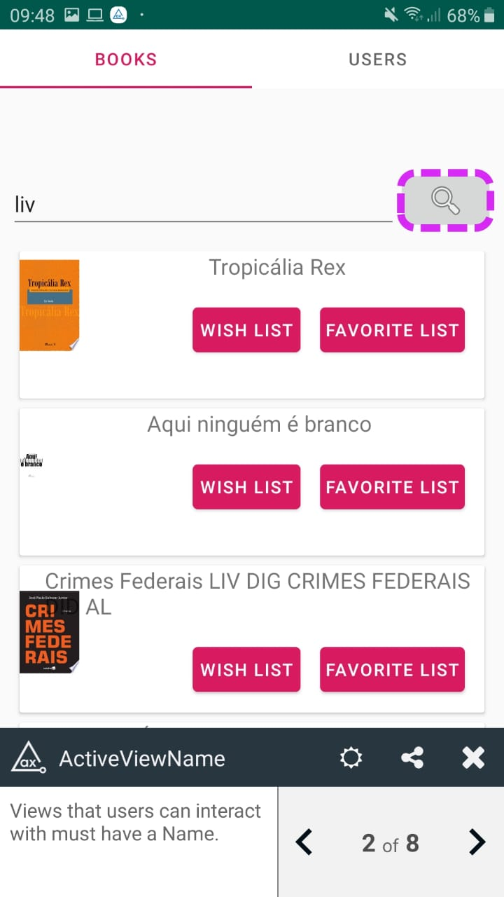

# Acessibilidade

Para o estudo da acessibilidade, foi utilizada a ferramenta Axe Android.

A ferramenta encontrou algumas violações a regras definidas para acessibilidade como mostrado abaixo

### Tela de perfil
O EditView clicavel não possuia o tamanho minimo requerido

### Tela de Mensagem
A view clicavel deve ter um atributo Name definido

View com valores modificaveis devem estar acompanhadas por um label

### Tela de Pesquisa
View com valores modificaveis devem estar acompanhadas por um label

A view clicavel deve ter um atributo Name definido

