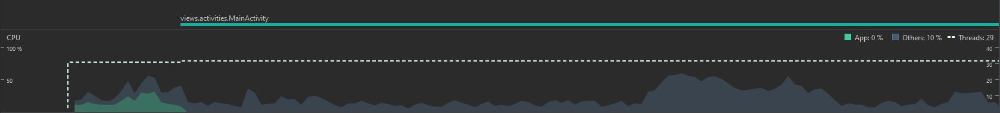

# CPU & Performance

Os testes para avaliar o consumo de CPU do nosso aplicativo foi feito sobre as principais telas: **Tela de perfil**, **Tela com os livros favoritos**, **tela de mensagem**,
**buscas de livros** e **usuários**. Para medir o consumo de CPU foi utilizado a ferramenta *Profiler* do *Android Studio*.

* Tela de perfil:

* Tela com os livros favoritos

* tela de mensagem

* buscas de livros

* usuários
